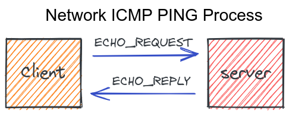
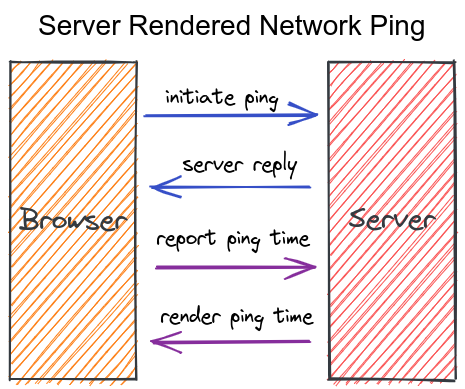

# Fly.io Laravel Livewire Hiring Project

Hello! This is a hiring project for our [Laravel Livewire position](https://fly.io/blog/fly-io-is-hiring-laravel-specialists/). If you apply, we'll ask you to do this project so we can assess your ability to write and create content around the Livewire framework.

## The Job

Fly.io sponsors the Laravel [Livewire](https://laravel-livewire.com/) project, and now we're hiring Laravel people.

Here's Fly.io's not-so-secret evil plan. We make it easy to run full-stack apps --- any app, in any framework --- close to your users. We're a simple and powerful way to run any application, with modern dev UX, advanced Postgres deployments with replication, and app scaling knobs that don't require you to learn Terraform to use. But we're especially shiny for frameworks that benefit from geographic distribution, like Elixir's [LiveView](https://fly.io/blog/how-we-got-to-liveview/) and Laravel's Livewire. We want those kinds of frameworks to succeed, because the better they do, the more valuable we are.

We want Fly.io to be the best place on the Internet to run Laravel apps, and especially Livewire. If you're a Laravel developer that's enthusiastic about Livewire, we need your help.

You can read more about the [job posting here](https://fly.io/blog/fly-io-is-hiring-laravel-specialists/). This is the project for applying.

## Hiring Project

We would like you to create a "recipe" blog post that a Laravel Liwewire developer could read and follow to add a specific feature to their own project. Here is the recipe we'd like you to create.

Add a self-serve diagnostic tool to a simple Livewire page. The tool measures the network ping time between the browser and the server rendering the page.

Feature description:

- User checks a checkbox, clicks a button or takes some other action to start displaying the ping time.
- Once activated, the ping runs once a second.
- The ping time is displayed in milliseconds.
- The ping measures the full network transfer time between the browser and the server.

### Why a ping?

Laravel Livewire lets developers create dynamic applications that are server rendered without needing to write custom javascript or using front-ends like React or Vue. When the server is dynamically rendering the page, then the total network response time becomes important. It directly impacts the user's experience! Longer network transfer times mean a less responsive application.

At Fly.io, we're all about moving the servers closer to the users! When server are geographically closer to users, it greatly reduces the network latency, improves the user experience, and makes Livewire even more valuable! This project is about helping to measure and visually display the ping time from the browser to the server and back to the browser.

### What we're looking for

We are looking for well written recipe articles that really highlight and use the Livewire framework. Yes, this feature could be done by writing custom javascript, but one of the benefits of Livewire is that developers don't _need_ to write custom Javascript. We'd like to see the Livewire framework used on the server and browser.

### PING Explanation

A quick explanation of a [network PING](https://www.activexperts.com/network-component/tutorials/ping/) and what this means.

The PING is initiated from the client. It measures the roundtrip network time to get from the client, to the server, and back to the client. Ping times will be higher when the distance travelled is greater or the server is less responsive because of load.

The idea with a ping is this:

- Client initiates the process by sending an "echo" request. You can think of it as simply "just reply back that you got my request".
- Server responds that the request was received.
- Client knows the local time of the first sent request and the local time of when the server response was received. Client computes the difference and this is the "ping time".
- Ping time is displayed.

Here is one possible way the process could be described when implemented in a server-rendered framework.

### Submissions

Submissions should include a written "recipe" blog post that explains the problem being solved and shows the solution for how to do it. The goal with the recipe is to help a Laravel developer figure out how to add something like this to their own project. More details are included on the recipe format and what that means.

We expect this to take some time to complete. If you're experienced this should take about 2-3 hours.

This is built to help us evaluate applicants but also for you to determine if this type of work interests you.

When you are ready to share your article with us, please submit it as a PR on the Github repo you are invited to and let us know it's ready!

### Resources you may find helpful

- [Fly Docs](https://fly.io/docs/introduction/)
- [Fly Getting Started Guides](https://fly.io/docs/getting-started/)
- [Fly Reference Guide](https://fly.io/docs/reference/)

### What we care about

See the [recipe style guide](./RECIPE_STYLE_GUIDE.md) for specific recipe format guidance and more detail on what we're looking for.

In short, here are some of the things we care about:

- Writing engages and interests the reader.
- It follows the [recipe style guide](./RECIPE_STYLE_GUIDE.md)
- Good technical quality.
- Simple and clear language.
- Easy to follow.

### What we don't care about

- **Don't** build more into the Laravel app than a single, simple, Livewire page. It doesn't need to do anything extra.
- **Don't** bother adding any CSS or styles. Submissions are not graded on how they _look_. The focus is on the writing component.
- **Don't** stress over turning in your submission quickly. The amount of time spent on your submission doesn't factor into the evaluations. You can take some time to think about things before you even start.
- **Don't** write a lot. There is no target word count, but we value efficient, short and to the point writing for recipes.
- **Don't** include a full Laravel project. No need to write tests either.
- **Don't** make this better than it needs to be. If you're like us, pride pushes you to make things better than they need to be. Don't do that here.
- **Don't** cover every edge case you can think of. Keep it simple and instructive.
