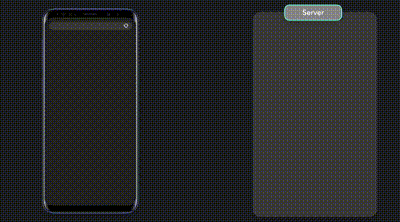
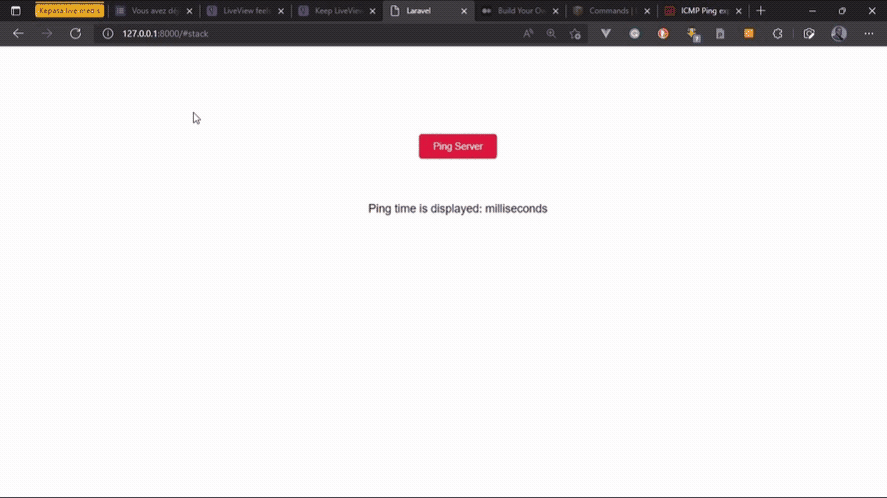

# How to ping a server with Livewire


This is a recipe about ping server in your Livewire app.
## Problem

You are a Laravel developer and you decide to develop your application with livewire using server side rendering. 

Notice the animation of an application using server side rendering... 

<div style="text-align: center;">



</div>

You notice that your application takes time to react to an action from the client trying to contact the server and from the server to the client. You want to find out by all possible means how you are going to visualize the ping time of the client request to the server and that of the server to the client.
 
After that, you wondered how you could display the time it takes for a request? 

## Solution

to solve this problem we suggest you first install livewire on your laravel project [livewire](https://laravel-livewire.com/); so by installing it, you will have access to a command ``make:livewire`` which will allow you to create a component.

Let's go directly to the creation of our component which will be named ``php artisan make:livewire PingServer`` and this command will generate two files; one file ``PingServer.php`` and one file ``ping-server.blade.php``. This is what our two files will look like.

```php
class PingServer extends Component
{
    public function render()
    {
        return view('livewire.ping-server');
    }
}
```

```html
<div>
    {{-- Be like water. --}}
</div>
```

To display the ping time, we need to add a button in our blade file to which we will add the directive ``wire:click="pingServer"`` which will look like this.

```html
<div>
    <button wire:click="showPing">Ping Server</button>
</div>
```
And in our class, we'll add a method to it with the same name as the one we have in our directive. 

Before going to the display of the ping time we have to know that with Laravel there is a global variable ``LARAVEL_START`` which allows to retrieve the launch time of a request and ``microtime()`` which returns current Unix timestamp.

To display the time of our request in milliseconds, we will add a variable in our component then multiply the value obtained by 1000 and add a PHP function ``round()`` which will allow us to round our values.

```php
class PingServer extends Component
{
    public float $ping;

    public function showPing()
    {
        $this->ping = round(microtime(true) * 1000) - round(LARAVEL_START * 1000);
    }

    public function render()
    {
        return view('livewire.ping-server');
    }
}
```

then to our view, let's add our ping variable which will be displayed once the client clicks on the button 

```html
<div>
    <button wire:click="showPing">Ping Server</button>

    <p>{{ $ping }}</p>
</div>
```

To make our view visible, we need to add the following Template to it ```<livewire:ping-server />``` and our solution will look like the following.



## Discussion (optional)

Livewire is an innovative technology. If the client's request takes longer than the server's, we will have a rendering that will allow us to know in how long the information I need has been rendered by the server. This is an interesting feature to know implement when working with this technology. And for more information please visit the official document or ask questions 